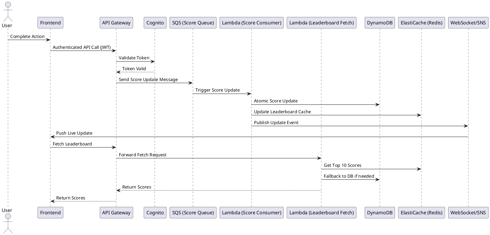
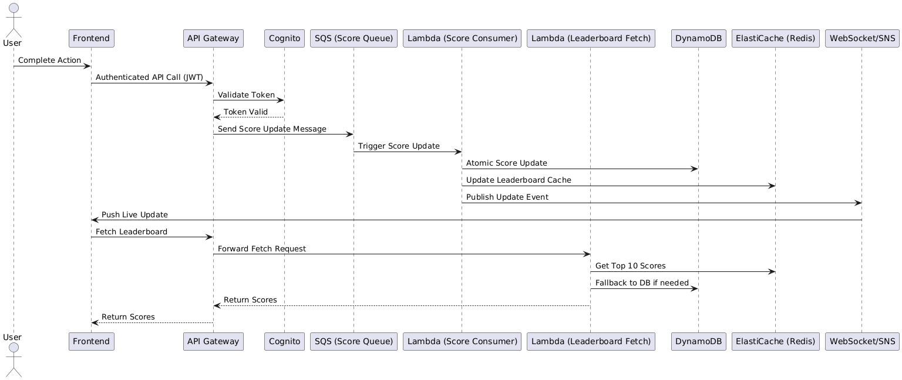

# API Service Module Design for Live Scoreboard

## Overview
This document outlines the design of a backend API service module for a live scoreboard system, leveraging AWS services to ensure scalability, security, and real-time updates. The design addresses high traffic, race conditions, and security concerns.

---

## Requirements Recap
1. Display top 10 users' scores on a website.
2. Live update of the scoreboard.
3. Users can perform an action to increase their score.
4. Action triggers an API call to update the score.
5. Prevent unauthorized score increases.

---

## AWS Architecture Components

- **API Gateway**: Entry point for all client requests, provides throttling and security features.
- **AWS Lambda**: Stateless compute for handling API logic (score updates, fetching leaderboard).
- **Amazon DynamoDB**: NoSQL database for storing user scores, supports atomic updates and high throughput.
- **Amazon ElastiCache (Redis)**: Caching layer for fast leaderboard reads and pub/sub for live updates.
- **Amazon Cognito**: User authentication and authorization.
- **Amazon SNS or WebSocket API Gateway**: For pushing live updates to clients.
- **CloudWatch**: Monitoring, logging, and alerting.

---

## Flow of Execution

### 1. User Action
- User completes an action on the website.
- Frontend dispatches an authenticated API call to the backend (API Gateway).

### 2. API Gateway
- Validates JWT token (via Cognito).
- Forwards request to Lambda function.

### 3. Lambda Function (Score Update)
- Verifies user identity and action validity.
- Atomically increments user score in DynamoDB (using `UpdateItem` with conditional expressions to prevent race conditions).
- Updates leaderboard cache in Redis.
- Publishes update event (via Redis Pub/Sub or SNS/WebSocket) for live scoreboard update.

### 4. Lambda Function (Leaderboard Fetch)
- Reads top 10 scores from Redis cache (fallback to DynamoDB if cache miss).

### 5. Live Update
- Clients subscribe to WebSocket or listen for SNS notifications for real-time updates.

---

## PlanUML Diagram

---

## Addressing Common Issues

### 1. High Traffic
- **API Gateway**: Throttling, request validation, and auto-scaling. Use usage plans and API keys for rate limiting.
- **Lambda**: Scales automatically with demand. Use provisioned concurrency for predictable workloads.
- **DynamoDB**: On-demand capacity, partitioning for high throughput, and auto-scaling. Use DynamoDB Accelerator (DAX) for even faster reads if needed.
- **Redis**: Caching reduces database load. Use Redis Cluster for horizontal scaling.
- **CloudFront**: Use as a CDN to cache API responses and static assets closer to users.
- **WAF (Web Application Firewall)**: Protects against common web exploits and bots.

### 2. Race Condition
- **SQS (Simple Queue Service)**: All score update requests are sent to an SQS queue. A dedicated Lambda function consumes messages from the queue and processes updates to DynamoDB sequentially. This ensures that updates for a given user are handled in order, preventing race conditions and lost updates.
- **DynamoDB**: Atomic `UpdateItem` operations with conditional expressions further ensure score increments are safe and consistent.
- **Redis**: Use transactions or Lua scripts if needed for cache consistency.
- **Idempotency**: Implement idempotency tokens for API requests to prevent duplicate score updates.

> **Trade-offs:**
> - Using SQS introduces eventual consistency; score updates may not be instantly reflected on the leaderboard.
> - This approach increases reliability and prevents race conditions at the cost of some latency for score updates.

### 3. Security
- **Cognito**: Ensures only authenticated users can update scores.
- **API Gateway**: Validates tokens, rate limits, and logs requests. Use resource policies to restrict access.
- **Lambda**: Validates user and action before updating scores. Use least-privilege IAM roles.
- **DynamoDB**: Fine-grained access control. Enable encryption at rest and in transit.
- **WAF**: Protects APIs from DDoS and common attacks.
- **VPC**: Place sensitive resources in private subnets.

### 4. DDoS Protection
- **AWS Shield**: Provides automatic DDoS protection for API Gateway and CloudFront.
- **WAF**: Custom rules to block malicious traffic.

### 5. Disaster Recovery & Reliability
- **Multi-AZ Deployments**: Use AWS services that support multi-AZ for high availability.
- **Backups**: Enable DynamoDB point-in-time recovery and regular Redis snapshots.
- **Infrastructure as Code**: Use CloudFormation or Terraform for reproducible deployments.

### 6. Data Consistency
- **DynamoDB**: Use conditional writes and transactions for strong consistency where needed.
- **Cache Invalidation**: Ensure Redis cache is updated or invalidated after score changes.

### 7. Observability & Monitoring
- **CloudWatch**: Monitor Lambda, API Gateway, DynamoDB, and Redis metrics. Set up alarms for anomalies.
- **X-Ray**: Distributed tracing for debugging and performance analysis.
- **Centralized Logging**: Aggregate logs for security and troubleshooting.

---

## Additional Comments for Improvement
- Use AWS WAF for additional API protection.
- Implement monitoring and alerting for suspicious activity (e.g., rapid score increases).
- Regularly audit IAM roles and permissions.
- Add request/response validation at API Gateway.
- Use environment variables and secrets management for sensitive configuration.
